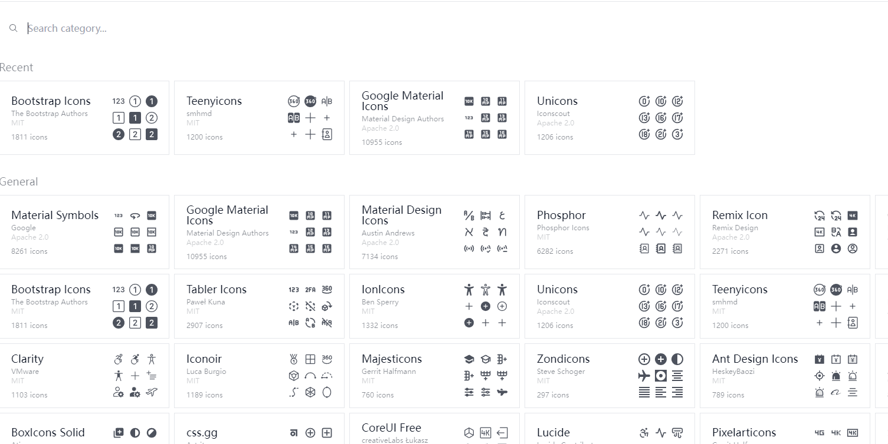
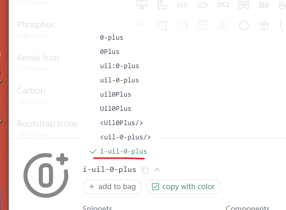

# vite-ts-2022
## 已配置好的开箱即用功能：


- `编程语言`：TypeScript 4.x 、JavaScript
- `前端框架`：Vue 3.x
- `构建工具`：Vite 2.x
- `UI 框架`：Element Plus
- `图标工具`：icones
- `CSS预编译`：Sass
- `CSS框架`：Windi CSS
- `HTTP工具`：Axios
- `路由管理`：Vue Router 4.x
- `状态管理`：Pinia
- `代码规范`：EditorConifg、Prettier、ESLint、Airbnb JavaScript Style Guide
- `提交规范`：husky、Commitlint 、lint-staged

功能插件：

- `实现自动按需加载（墙裂推荐）`：unplugin-auto-import、unplugin-vue-components、unplugin-icons
- `实现 SVG图标 的组件化`：vite-svg-loader
- `让各种 API 支持响应式`：VueUse
- `进度条`：NProgress


## vite
### vite 初始化
vite 创建一个 vue3 + typescript 基本项目的指令：

`npm init vue@latest`

项目建立过程如下


### 配置 vite 服务设置
我们配置 vite.config.ts ，加入以下配置
值得注意的是：我们只有配置了 host 之后，我们本地才可以通过 ip 进行访问项目
```
server: {
    host: true, // host设置为true才可以使用network的形式，以ip访问项目
    port: 8080, // 端口号
    open: true, // 自动打开浏览器
    cors: true, // 跨域设置允许
    hmr:true, // 热加载
    strictPort: false, // 设为true端口已占用直接退出, false 尝试下一个可用端口
    // 接口代理
    proxy: {
      '/api': {
        // 本地 8000 前端代码的接口 代理到 8888 的服务端口
        target: 'http://localhost:8888/',
        changeOrigin: true, // 允许跨域
        rewrite: (path) => path.replace('/api/', '/'),
      },
    },
  },
```
配置 build 配置
我们可以设置打包时移除代码中的 console ，以及配置打包后的静态资源到 dist 下不同的目录
```
build: {
    // 打包大小超过2000kb警告
    chunkSizeWarningLimit: 2000,
    // 压缩混淆，esbuild 比 terser 快 20-40 倍，压缩率只差 1%-2%
    minify: 'esbuild',
    // 在生产环境移除console.log
    terserOptions: {
      compress: {
        drop_console: false,// 不注释console
        pure_funcs: ['console.log', 'console.info'],// 移除这两种cons日志
        drop_debugger: true, // 注释debugger
      },
    },
    assetsDir: 'static/assets',
    // 静态资源打包到dist下的不同目录
    rollupOptions: {
      output: {
        chunkFileNames: 'static/js/[name]-[hash].js',
        entryFileNames: 'static/js/[name]-[hash].js',
        assetFileNames: 'static/[ext]/[name]-[hash].[ext]',
      },
    },
  },
```
配置 vite 环境变量
经常，我们需要去区分生产环境和开发环境，我们在根目录下新建三个文件用来放环境变量：

- .env
- .env.development
- .env.production

其中 .env 配置如下：
```
// 接口前缀
VITE_API_BASEURL = /api
// 项目基础路径前缀
VITE_BASE = /
// 网页标题
VITE_APP_TITLE  = base-vue3
```

`VITE_API_BASEURL` 是项目的api基础前缀

`VITE_BASE` 是项目的基础路径前缀

`VITE_APP_TITLE` 是项目的网页标题

### 自动按需加载 api & 组件 & 样式

- 你是否厌烦了每次使用 vue 时，需要不断的 import vue 的 api
- 你是否厌烦了每次使用 组件库 时，需要不断的 按需引入 组件
- 你是否厌烦了有时使用 第三方组件库 时，需要额外引入 css 样式

现在有两个插件可以帮我们解决这些问题，我们在调用时可以不需要import而直接使用，且最终打包时，只有实际使用过的api和组件才会被build进最终产物，
它们就是 `unplugin-auto-import` 和 `unplugin-vue-components`

- `unplugin-auto-import`：自动按需引入 vue\vue-router\pinia 等的api

- `unplugin-vue-components`：自动按需引入 第三方的组件库组件 和 我们自定义的组件


安装配置
我们先安装依赖：

`npm install -D unplugin-vue-components unplugin-auto-import`

然后我们配置 vite.config.ts 加入以下内容；
```
// vite.config.ts
import AutoImport from 'unplugin-auto-import/vite'
import Components from 'unplugin-vue-components/vite'

export default {
  plugins: [
    // ...
    AutoImport({
      dts: './src/auto-imports.d.ts',
      imports: ['vue', 'pinia', 'vue-router', '@vueuse/core'],
      // Generate corresponding .eslintrc-auto-import.json file.
      // eslint globals Docs - https://eslint.org/docs/user-guide/configuring/language-options#specifying-globals
      eslintrc: {
        enabled: true, // Default `false`
        filepath: './.eslintrc-auto-import.json', // Default `./.eslintrc-auto-import.json`
        globalsPropValue: true, // Default `true`, (true | false | 'readonly' | 'readable' | 'writable' | 'writeable')
      },
    }),
    Components({
      dts: './src/components.d.ts',
      // imports 指定组件所在位置，默认为 src/components
      dirs: ['src/components/'],
    }),
  ],
}
```
因为我们使用了 ESLint 我们还需要去 .eslintrc.js 中配置：

```
// .eslintrc.js

module.exports = { 
  /* ... */
  extends: [
    // ...
    './.eslintrc-auto-import.json',
  ],
}
```
## Element Plus

### 安装配置

`npm install element-plus --save`

然后我们在 vite.config.ts 中配置上文配置了的 AutoImport 和 Components中的 resolvers

```
// vite.config.ts
import AutoImport from 'unplugin-auto-import/vite'
import Components from 'unplugin-vue-components/vite'
import { ElementPlusResolver } from 'unplugin-vue-components/resolvers'

export default {
  plugins: [
    // ...
    AutoImport({
      resolvers: [ElementPlusResolver()],
    }),
    Components({
      resolvers: [ElementPlusResolver()],
    })
  ],
}
```

### 设置中文主题
Element Plus 默认的是英文，如果我们要使用中文主题，就可以在 APP.vue 中设置
```
<script setup lang="ts">
import zhCn from 'element-plus/lib/locale/lang/zh-cn';
const locale = zhCn;
</script>

<template>
  <el-config-provider :locale="locale">
    <router-view></router-view>
  </el-config-provider>
</template>
```

## vite-svg-loader
这个插件可以让我们直接引入 svg 文件来使用，就像使用 Vue组件 一样
### 安装流程
`npm i vite-svg-loader -D`

然后配置 vite.config.ts
```
import svgLoader from 'vite-svg-loader'

export default defineConfig({
    plugins: [...,svgLoader()]
})
```

使用示例
```
<script setup lang="ts">
import MyIcon from "@/assets/svg_test.svg?component";
</script>

<template>
  <MyIcon />
</template>
```

## unplugin-icons
我们经常都要为找各种各样的图标而发愁，而现在有一个极好的插件和一个极好的库，可以直接解决我们找图标、用图标的后顾之忧

- `icones`：是一个非常优秀的图标库，里面集成了很多的图标
- `unplugin-icons`：可以自动按需引入我们所要使用的图标，而不用手动 import

### 安装配置
`npm i -D unplugin-icons @iconify/json`

安装好后，我们配置 vite.config.ts 加入以下内容
```
// vite.config.ts
import Icons from 'unplugin-icons/vite'
import IconsResolver from 'unplugin-icons/resolver'
import Components from 'unplugin-vue-components/vite'

export default {
  plugins: [
    Components({
      resolvers: IconsResolver(),
    }),
    Icons({
      compiler: 'vue3',
      autoInstall: true,
    }),
  ],
}
```
使用示例
我们先打开网址：https://icones.js.org/ 随便选择一个图标


然后点击复制


回到我们的代码中，只需要短短的一句就可以使用了：
```
<template>
    <i-uil-0-plus style="font-size: 2em; color: red" />
</template>
```
效果如下


## Pinia

Pinia.js 是新一代的状态管理工具，可以认为它是下一代的 Vuex，即 Vuex5.x；它相比于 Vuex 有几个比较明显的变化：

更好的 typescript 支持
移除了 mutations 只留下 actions; actions 支持同步以及异步
无需手动添加 store

### 安装配置
这个在开始已经装好了，就不写配置了，我们进入`src/store/couter.ts`文件夹

可以看到已经定义了一个变量和一个方法
```
import { ref, computed } from "vue";
import { defineStore } from "pinia";

export const useCounterStore = defineStore("counter", () => {
  const count = ref(0);
  const doubleCount = computed(() => count.value * 2);
  function increment() {
    count.value++;
  }

  return { count, doubleCount, increment };
});

```
调用方式如下：
```
<script setup lang="ts">
import { useCounterStore } from '@/stores/counter'
const userCount = useCounterStore()

</script>

<template>
  <el-button @click="userCount.increment">increment</el-button>
  {{userCount.count}}
</template>
```

## SCSS
### 安装配置
`npm i sass -D`
复制代码
我们在 src/assets 目录下新建 variables.scss 文件，用来存放我们全局的 css 变量，我们先只配置一个主题色：
同时我们也在 src/assets 目录下新建 index.scss，在它里面引入我们未来将要新建的 scss 文件；并在 main.ts 中引入它
```
$theme-color: #2080F0FF
```
 
然后打开 vite.config.ts 文件，加上 css 配置的引入
```
css: {
  preprocessorOptions: {
    scss: {
      additionalData: `
      @import "@/assets/styles/variables.scss";
    `,
      javascriptEnabled: true,
    },
  },
},
```
组件中的使用方式
按上述配置完后，我们在组件中不需要任何的引入，就可以直接进行使用我们在 `variables.scss` 中定义的变量：
```
<style lang="scss">
.myclass {
  color: $theme-color;
}
</style>
```

## Windi CSS
Windi CSS 可以视为 Tailwind CSS 的上位替代品，它提供更快的加载时间、与 Tailwind v2.0 的完全兼容性以及一系列额外的酷功能。
我们可以进行 原子化 的css编程，并且框架自动帮我们做好了按需引入的工作；
### 安装配置
`npm i -D vite-plugin-windicss windicss`

安装完依赖后，我们在 vite.config.ts 中安装此插件
```
import WindiCSS from 'vite-plugin-windicss'

export default {
  plugins: [
    WindiCSS(),
  ],
}
```

然后，我们在 main.ts 中引入它

`import 'virtual:windi.css'`

## Axios
### 安装配置
`npm i axios -S`

### 基本封装
安装完后我们再在 src/api 目录下新建 http.ts 配置文件，用来封装 axios 方法，简单配置如下：

```
// src/api/http.ts
import axios, { AxiosInstance, AxiosRequestConfig, AxiosResponse, AxiosError } from 'axios';
import { ElMessage } from 'element-plus';
import showCodeMessage from '@/api/code';

const BASE_PREFIX = '/api';

// 创建实例
const service: AxiosInstance = axios.create({
  // 前缀
  baseURL: BASE_PREFIX,
  // 超时
  timeout: 1000 * 60 * 30,
  // 请求头
  headers: {
    'Content-Type': 'application/json',
  },
});

// 请求拦截器
service.interceptors.request.use(
  (config: AxiosRequestConfig) => {
    // TODO 在这里可以加上想要在请求发送前处理的逻辑
    // TODO 比如 loading 等
    return config;
  },
  (error: AxiosError) => {
    return Promise.reject(error);
  },
);

// 响应拦截器
service.interceptors.response.use(
  (response: AxiosResponse) => {
    if (response.status === 200) {
      return response;
    }
    ElMessage.info(JSON.stringify(response.status));
    return response;
  },
  (error: AxiosError) => {
    const { response } = error;
    if (response) {
      ElMessage.error(showCodeMessage(response.status));
      return Promise.reject(response.data);
    }
    ElMessage.warning('网络连接异常,请稍后再试!');
    return Promise.reject(error);
  },
);

export default service;

```

我们再新建一个 code.ts 用来存放我们 http 请求后接收到状态码的处理逻辑
```
// src/api/code.ts
declare interface codeMessageMapTypes {
  400: string;
  401: string;
  403: string;
  404: string;
  405: string;
  500: string;
  [key: string]: string;
}

const codeMessageMap: codeMessageMapTypes = {
  400: '[400]:请求参数错误',
  401: '[401]:账户未登录',
  403: '[403]:拒绝访问',
  404: '[404]:请求路径错误',
  405: '[405]:请求方法错误',
  500: '[500]:服务器错误',
};

const showCodeMessage = (code: number | string): string => {
  return codeMessageMap[JSON.stringify(code)] || '网络连接异常,请稍后再试!';
};

export default showCodeMessage;

```

## VueUse
VueUse 是一个响应式的 Vue 实用程序的合集，使用它，我们可以把各种各样的东西变成响应式而不用我们手动编写 hook
### 安装配置
`npm i npm i @vueuse/core -D`

安装完依赖后，我们还需要在 vite.config.ts 中配置 自动按需引入
```
import { VueUseComponentsResolver } from 'unplugin-vue-components/resolvers';

export default defineConfig({
  plugins: [
    AutoImport({
      imports: ['@vueuse/core'],
    }),
    Components({
      resolvers: [VueUseComponentsResolver()],
    }),
  ],
});
```
这样配置完之后，我们就不需要再自己去引入方法，可以直接使用啦
## NProgress
这个插件相信大部分人都有用过，它可以帮助我们在顶部加上页面加载提示：一个加载进度条和一个转的圈
### 安装配置
`npm i --save nprogress`

我们因为用着 typescript 所以还需要安装它的 types
`npm i @types/nprogress -D`

安装完之后，我门回到 src/router/index.ts 配置我们的路由守卫
```
import NProgress from 'nprogress';
router.beforeEach((to, from) => {
  if (!NProgress.isStarted()) {
      NProgress.start();
  }
});

router.afterEach((to, from) => {
  NProgress.done();
});

```
我们再在 src/assets/styles 目录下新建 nprogress.scss 文件配置如下：
```
/* Make clicks pass-through */
#nprogress {
  pointer-events: none;
}

#nprogress .bar {
  background: $theme-color;

  position: fixed;
  z-index: 1031;
  top: 0;
  left: 0;

  width: 100%;
  height: 2px;
}

/* Fancy blur effect */
#nprogress .peg {
  display: block;
  position: absolute;
  right: 0px;
  width: 100px;
  height: 100%;
  box-shadow: 0 0 10px $theme-color, 0 0 5px $theme-color;
  opacity: 1.0;

  -webkit-transform: rotate(3deg) translate(0px, -4px);
  -ms-transform: rotate(3deg) translate(0px, -4px);
  transform: rotate(3deg) translate(0px, -4px);
}

/* Remove these to get rid of the spinner */
#nprogress .spinner {
  display: block;
  position: fixed;
  z-index: 1031;
  top: 15px;
  right: 15px;
}

#nprogress .spinner-icon {
  width: 18px;
  height: 18px;
  box-sizing: border-box;

  border: solid 2px transparent;
  border-top-color: $theme-color;
  border-left-color: $theme-color;
  border-radius: 50%;

  -webkit-animation: nprogress-spinner 400ms linear infinite;
  animation: nprogress-spinner 400ms linear infinite;
}

.nprogress-custom-parent {
  overflow: hidden;
  position: relative;
}

.nprogress-custom-parent #nprogress .spinner,
.nprogress-custom-parent #nprogress .bar {
  position: absolute;
}

@-webkit-keyframes nprogress-spinner {
  0% {
    -webkit-transform: rotate(0deg);
  }

  100% {
    -webkit-transform: rotate(360deg);
  }
}

@keyframes nprogress-spinner {
  0% {
    transform: rotate(0deg);
  }

  100% {
    transform: rotate(360deg);
  }
}
```

## Customize configuration

See [Vite Configuration Reference](https://vitejs.dev/config/).

## Project Setup

```sh
npm install
```

### Compile and Hot-Reload for Development

```sh
npm run dev
```

### Type-Check, Compile and Minify for Production

```sh
npm run build
```

### Run Unit Tests with [Vitest](https://vitest.dev/)

```sh
npm run test:unit
```

### Run End-to-End Tests with [Cypress](https://www.cypress.io/)

```sh
npm run build
npm run test:e2e # or `npm run test:e2e:ci` for headless testing
```

### Lint with [ESLint](https://eslint.org/)

```sh
npm run lint
```
